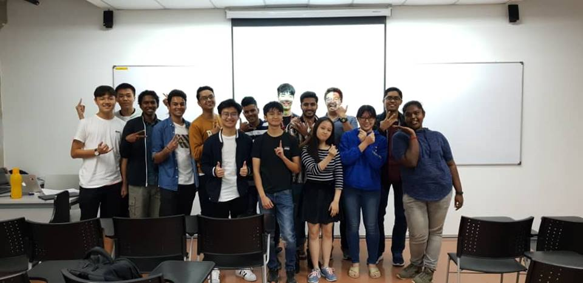
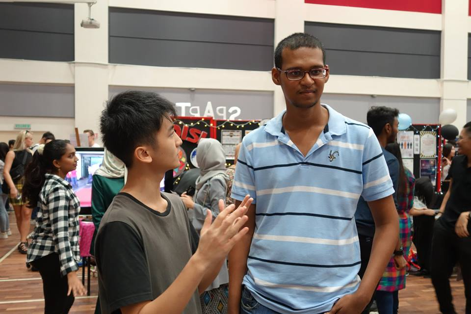

To give a little bit of context, Agents of Tech by Taylor's University has existed since 2015. Our club has achieved magnificent milestones in the past. From annual large scale competitions to mini sharing sessions, we even organized hackathons that had 100+ participants!

## The Truth

Agents of Tech hasn't been in most glorious state after ImagineHack which was held in 2016. Although there were projects and workshops such as teaching refugees to code and mini workshops that were held after 6pm such as 'How To Design A Mobile App', but our momentum wasn't the same anymore. But fear not, things will be different in this term.

## Good News: Agents of Tech Is Back!

Yeah, you heard it. This will be happening on Aug 2019, which is this month! The reason why we do this is to help the Malaysian tech community grow. As the new President of Agents of Tech from Aug 2019, I sincerely believe that tech is an industry that is everywhere now, therefore it is highly essential for students to understand it. For those who are bothered by their curiosity for tech, I believe Agents of Tech is the place for them to fulfill that need.

---

###### Welcoming Party During March 2019

## Who Are We?

Now that you have the simplified story of what happened to Agents of Tech, you might wonder: What do you guys do then?

> Agents of Tech exists to satisfy anyone that has a curiosity for tech. From hardcore coding to stunning designs, we provide workshops to get you equipped with the 21st Century tech skillset.

In simple words, we want to gather tech enthusiasts among students and cultivate their tech skills.

Note: Tech enthusiasts come in all shapes and sizes, you don't need to be a nerd or always wearing a hoodie to be a part of us. We welcome diversity(including women) because diversity creates perspective and form a more wholistic club.

---

## 2019/2020 Goals

#### 1. Weekly Online Content

Our social media and main website will be posting tips/tricks to help you learn. Content will be ranging from coding tutorials, tech advice to get started, cool hobby projects, etc.

#### 2. Code Bandit Program

Agents of Tech is proud to present our coding mentoring program where we guide committed students closely to level up their coding skills. The goal is to equip beginners to a junior web developer position that can land you a job(hopefully).

It will be RM30/student or RM100/adult, which lasts for 6 months. Our pricing is very affordable because our club is not profit-motivated. We want to ensure that people who are committed will benefit from this.

For those who are interested, please register at link.

#### 3. Write Articles & Gain Recognition

Ever wanted to voice your opinion about the new phone such as Samsung Note 10 or comment about Sophia the robot? Agents of Tech is the best place for you to do it!

Once your draft is reviewed by the Agents of Tech Exco, we will publish it and share it across all our platforms!

For those who are interested, please register here.

#### 4. Volunteer & Collaborate with exciting projects!

Our club often has ongoing tech projects that might be due to self-interest or a problem that someone else is facing. Most of the time, you will be working with elites of the club that has working experience.

For instance, have you ever wondered how to create an Instagram bot? Or maybe create a mobile app to track the Bus GPS? (This might be an upcoming project)

Sometimes, we might also collaborate with companies outside, so that you can have an opportunity to see what coders or designers do in their daily lives. (We might even brainstorm with them in their app design etc)

For those interested, please register here.

---

## Closing Thoughts

All that is mentioned above basically sums up the goals that we are looking to achieve this year. Also, be sure to check us out during C&S Expo August 2019!

